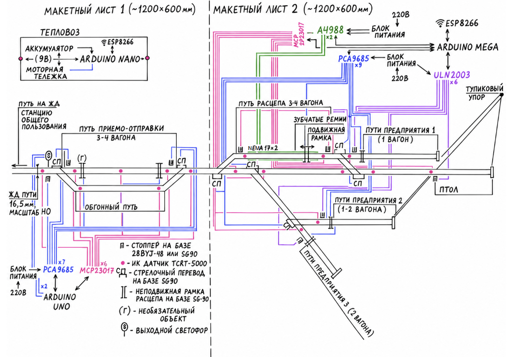
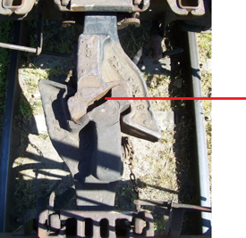

# Automated industrial railway station with a modular control system and a full railcar sorting cycle.

## Проектное предложение

**Название проекта:**  
Автоматизированная станция промышленного предприятия с модульной системой управления и полным циклом сортировки вагонов.

**Ментор:**  
Тавитов Азамат Георгиевич

**Команда:**  
Поволоцкий Тимофей Константинович, группа Б01-505  
@kmz89_atp, povolotskii.tk@phystech.edu

---

## Цель проекта

Создать функциональный прототип полностью автоматической станции для обслуживания промышленных предприятий. Прототип включает: автономный маневровый локомотив, систему технического зрения, стационарные и подвижные «арки-расцепки» вагонов, а также модульное ПО на языке C для цифровой логистики и управления движением без участия человека.

---

## Функциональные возможности

**1. Цифровая логистика с БД:**
- Хранение данных о вагонах (тип, собственник, груз, класс опасности, адресат).
- Приём заявок от производств, автоматическое распределение вагонов с учётом приоритетов и правил прикрытия.
- Расписание подач составов.

**2. Автоматическая расцепка/сцепка вагонов специальной аркой**

**3. Безопасность и контроль занятости:**
- Сеть щелевых ИК-датчиков на путях и стрелках (опрос 10 Гц).
- Автоматические стопперы (выдвижные упоры) для закрепления составов на путях отстоя вагонов.
- Dead man's switch: потеря связи => остановка локомотива.

**4. Управление движением и инцидентами:**
- Автоматическая прокладка маршрутов с контролем вместимости путей.
- Аварийная и маневровая пауза, оповещение предприятий, восстановление графика.

**5. Диагностика и веб-интерфейс:**
- Журналирование всех событий в БД, предиктивная диагностика датчиков.
- Веб-интерфейс для визуализации состояния станции.

---

## Задачи проекта

1. CAD-моделирование деталей (арки, корпуса датчиков, стопперы, оснастка).
2. Лазерная резка фанеры (габаритная рамка, элементы корпусов конструкций).
3. 3D-печать корпусов, креплений, направляющих, опорной рамы тепловоза, стопперов, рамок расцепа.
4. Сборка макета: укладка путей, стрелок, датчиков, арок, стопперов.
5. Разработка модулей «Топология» (классы «Парк», «Путь», «Стрелка») для модульности системы, «GPIO» (опрос датчиков, управление светофором, стопперами, стрелками), «Радиоканал», «Компьютерное зрение», «Сортировка».
6. Веб-интерфейс (бэкенд на C, фронтенд для визуализации) — *не обязательный пункт*.

---

## Анализ существующих аналогов

### Промышленные образцы

| Аналог | Сильные стороны | Слабые стороны |
|--------|----------------|----------------|
| «Автомашинист» (РЖД) ст.Челябинск-Гл. | Беспилотное маневровое движение | 1. Закрытая система 2. Привязка к новым локомотивам 3. Высокая стоимость 4. Множественные выявленные конструкционные ошибки |
| EntKuRo (Австрия) | Авто-расцепка винтовой стяжки | 1. Только одна задача 2. Сложный робот 3. Не подходит для российских железных дорог |
| Outrider (США) | Автономный тягач для прицепов | 1. Не для ж/д вагонов |

### DIY образцы

Устройство расцепа жд моделей с двумя видами сцепок.

Данные образцы хорошо подходят для макетов железных дорог, но не могут быть реализованы в нашем проекте, т.к. не могут использоваться в реальности по следующим причинам:

1. Несоответствие технике безопасности — на жд путях не должно быть элементов, выпирающих выше рельс.
2. Реальная автосцепка работает иначе и для расцепа необходимо разжать механизм в центре устройства — это можно сделать только сверху, с арки.

3. При реализации проекта с аркой мы делаем типовое решение, т.к. для создания устройства расцепа можно использовать неэксплуатируемые мостовые краны.

---

## Ключевое преимущество проекта

Целостная, масштабируемая и бюджетная система автоматизации небольшой станции. Заказчик сам выбирает конфигурацию (стационарные или подвижные арки, наличие габаритной рамки, количество путей и т.п.). Модернизация существующего тепловоза возможна за несколько дней с минимальными затратами.

Проект ориентирован на северные регионы с низкими температурами (минимизация ручного труда) и предприятия с большим оборотом вагонов.

---

## Эскиз проекта

Общий принцип работы: тепловоз заталкивает состав на путь расцепа, подвижная арка расцепляет вагоны, система распределяет их по предприятиям согласно заявкам и формирует отправной состав. Вагоны без тепловоза закрепляются стопперами, их наличие на путях фиксируется ИК датчиками. Сформированный состав протягивается на путь отправки.

Макет собирается на 2-3 листах материала типа пеноплекс. Контроллеры питаются от ноутбука. Блоки питания от 3-х источников тока 220В.

---

## Элементная база

### Управляющая электроника
- Raspberry Pi 5 (при условии использования камеры для считывания номеров вагонов)
- Arduino Uno R3 (для сбора данных с датчиков и управления оборудованием макетного листа №1)
- Arduino Mega (подконтроллер, опрос датчиков, приводы оборудования макетного листа №2)
- Arduino Nano (бортовой контроллер тепловоза)
- Расширители: PCA9685 (2 шт.)
- Драйвер шагового двигателя A4988 (2 шт.)
- Драйвер для 28BYJ-48 — ULN2003 (6 шт.)
- Драйвер ИК-датчиков MCP23017

### Сенсоры
- TCRT5000 (16-20 шт.) — верификация расцепа, контроль занятости путей, датчики сближения на тепловозе

### Актуаторы
- Сервоприводы MG90S (16-18 шт.) — перевод стрелок
- Шаговые двигатели NEMA 17 (2 шт.) — для подвижной арки
- Шаговые двигатели 28BYJ-48 (~6-8 шт.) — стопперы
- Моторная тележка локомотива с мотором DC 9V (2 шт.)
- Блоки питания 12В / 5А (3 шт.)
- Аккумулятор 9В для установки на тепловоз

### Связь
- Радиомодуль ESP8266 (контроллер ↔ локомотив) — 2 шт.

### Дополнительные материалы для макета
- Рельсы (прямые и кривые 15°) и стрелки масштаба H0 (1:87) общей протяжённостью ~4,5 м
- Модели вагонов (7-8 шт.) и части модели тепловоза
- Плетевые сцепки для тепловоза и вагонов
- Колесные пары для вагонов (металлические/пластиковые оси)
- Ремень зубчатый (2 шт.)

---

📄 **[Скачать проектное предложение (PDF)](https://github.com/TP89k/Automated-industrial-railway-station-with-a-modular-control-system-and-a-full-railcar-sorting-cycle./blob/main/%D0%9F%D1%80%D0%BE%D0%B5%D0%BA%D1%82%D0%BD%D0%BE%D0%B5%20%D0%BF%D1%80%D0%B5%D0%B4%D0%BB%D0%BE%D0%B6%D0%B5%D0%BD%D0%B8%D0%B5%204.0%20(1).pdf)**
